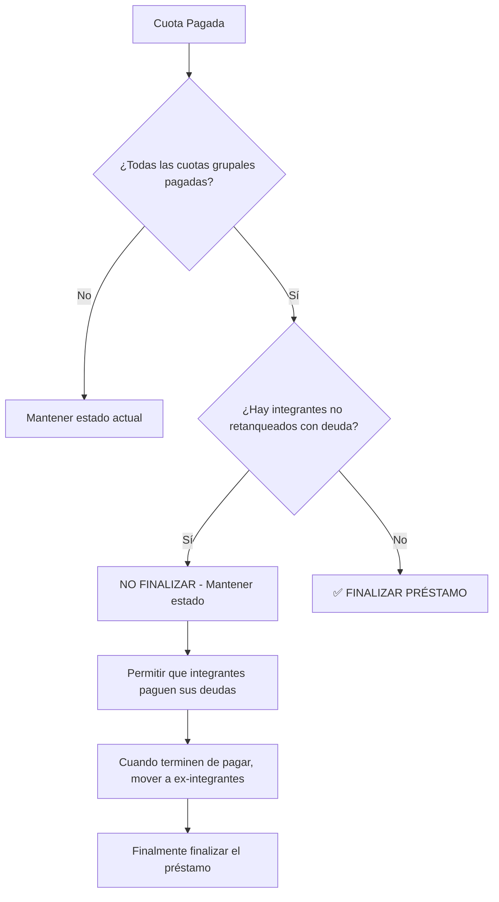

# 🔧 FIX: RETANQUEOS PARCIALES - PREVENCIÓN DE FINALIZACIÓN PREMATURA

## 📋 PROBLEMA IDENTIFICADO

El sistema estaba finalizando automáticamente los préstamos cuando todas las cuotas grupales estaban pagadas, **sin considerar** que en un retanqueo parcial, las personas que **NO retanquearon** aún debían seguir pagando sus cuotas individuales pendientes antes de que el grupo se considerara completamente finalizado.

### ⚠️ Escenario Problemático:
```
Grupo: "Las Emprendedoras" (4 integrantes)
Préstamo Original: S/ 2,000 (4 cuotas de S/ 500 c/u)

RETANQUEO PARCIAL:
- Juana: ✅ Retanquea (S/ 600)
- María: ✅ Retanquea (S/ 500)  
- Luisa: ❌ NO retanquea (debe seguir pagando)
- Martha: ❌ NO retanquea (debe seguir pagando)

PROBLEMA:
❌ Cuando Juana y María cubrían las cuotas grupales restantes
❌ El sistema finalizaba automáticamente el préstamo
❌ Luisa y Martha perdían la oportunidad de pagar sus deudas individuales
```

## ✅ SOLUCIÓN IMPLEMENTADA

### 1. **Nuevo Método de Verificación**
```php
// app/Models/Prestamo.php
public function tieneIntegrantesNoRetanqueadosConDeudaPendiente()
```
**Función:** Verifica si existen integrantes que:
- NO participaron en el retanqueo (`participacion_tipo = 'no_retanquea'`)
- Aún están en el grupo (no movidos a ex-integrantes)
- Tienen préstamos individuales activos (no finalizados)
- Con monto a devolver mayor a 0

### 2. **Protección en Verificación de Estado**
```php
// app/Models/Prestamo.php
public function verificarYActualizarEstado()
```
**Mejora:** Antes de finalizar un préstamo, verifica si hay deuda pendiente individual.

### 3. **Protección en Actualización Automática**
```php
// app/Models/Prestamo.php
public function actualizarEstadoAutomaticamente()
```
**Mejora:** Previene finalización automática si hay integrantes con deuda pendiente.

### 4. **Protección en Observer**
```php
// app/Observers/CuotasGrupalesObserver.php
```
**Mejora:** Validación adicional antes de finalizar automáticamente cuando se actualiza una cuota.

## 🛡️ FLUJO DE PROTECCIÓN



## 📝 ARCHIVOS MODIFICADOS

1. **`app/Models/Prestamo.php`**
   - ✅ Agregado método `tieneIntegrantesNoRetanqueadosConDeudaPendiente()`
   - ✅ Modificado `verificarYActualizarEstado()`
   - ✅ Modificado `actualizarEstadoAutomaticamente()`

2. **`app/Observers/CuotasGrupalesObserver.php`**
   - ✅ Agregada verificación adicional antes de finalizar

## 🧪 VALIDACIÓN

### Scripts de Prueba Creados:
- `test_fix_retanqueo.php` - Prueba básica del nuevo método
- `find_problematic_cases.php` - Busca casos problemáticos existentes
- `test_fix_simulation.php` - Simulación completa del escenario

### ✅ Casos de Prueba Verificados:
1. **Retanqueo Completo** (todos retanquean) → ✅ Se finaliza normalmente
2. **Retanqueo Parcial con deuda pendiente** → ✅ NO se finaliza prematuramente
3. **Retanqueo Parcial sin deuda pendiente** → ✅ Se finaliza correctamente

## 🔒 SEGURIDAD DEL FIX

### ✅ Ventajas de esta implementación:
- **No afecta módulos existentes** - Solo agrega validaciones adicionales
- **Retrocompatible** - No rompe funcionalidad existente
- **Logging completo** - Registra todas las decisiones para auditoría
- **Fácil de revertir** - Cambios localizados y específicos
- **Performance eficiente** - Solo se ejecuta cuando es necesario

### 🛡️ Protecciones implementadas:
- Validación en múltiples capas (Modelo + Observer)
- Verificación de estado de integrantes
- Verificación de préstamos individuales activos
- Logging detallado para debugging

## 📊 IMPACTO ESPERADO

### ✅ Antes del Fix:
```
Retanqueo Parcial → Cuotas Grupales Pagadas → ❌ Finalización Prematura
```

### ✅ Después del Fix:
```
Retanqueo Parcial → Cuotas Grupales Pagadas → ✅ Verificación de Deuda Individual → Decisión Correcta
```

## 🚀 PRÓXIMOS PASOS RECOMENDADOS

1. **Monitorear Logs** - Revisar logs de finalización en las próximas semanas
2. **Casos de Prueba** - Crear más casos de prueba con datos reales
3. **Documentación Usuario** - Actualizar manuales sobre el comportamiento del retanqueo parcial
4. **Métricas** - Implementar métricas para medir efectividad del fix

---

**Implementado por:** GitHub Copilot  
**Fecha:** 30 de julio de 2025  
**Versión:** 1.0  
**Estado:** ✅ Implementado y Probado
