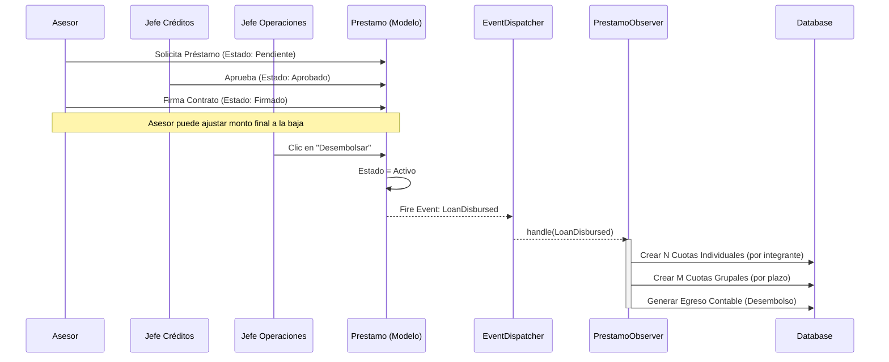
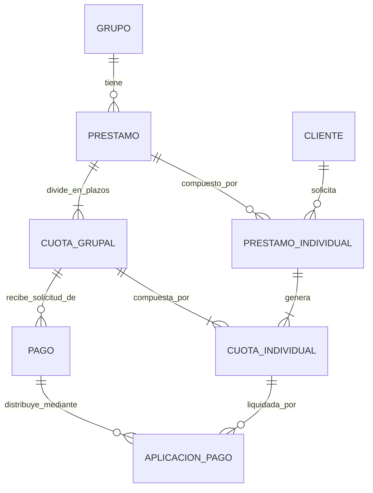

# Arquitectura y Análisis de Sistemas: EC-Antigravity

Este documento establece el marco arquitectónico, los dominios de negocio y los estándares internacionales de calidad (ISO 25000) que rigen el núcleo financiero del sistema. Es la hoja de ruta definitiva para agentes de IA y desarrolladores.

---

## 1. Contexto del Proyecto y Dominios (Domain-Driven Design)

El sistema se divide en **Dominios Core** enfocados en la alta cohesión y bajo acoplamiento, siguiendo los principios de la Arquitectura Limpia (Hexagonal).

### Dominio Core Financiero (El "Corazón")
Responsable de la integridad matemática y el ciclo de vida del dinero.
*   **Entidades Core:** `Prestamo` (Agregado Raíz), `CuotaGrupal`, `CuotaIndividual`, `Pago`, `AplicacionPago` (Ledger V2).
*   **Servicios de Dominio:** `PagoService` (distribución matemática exacta), `LoanStateMachine` (transiciones seguras).

### Dominio de Gestión de Riesgo y Clientes
Responsable de la evaluación y comportamiento del usuario.
*   **Entidades Core:** `Cliente`, `Grupo`, `Reagrupacion`, `CicloCrediticio`.
*   **Servicios de Dominio:** `MorosoSeparationService`, `CreditCycleEvaluator`.

### Dominio de Configuración y Parametrización
Responsable de las reglas mutables del negocio (Panel Súper Admin).
*   **Entidades Core:** `BusinessRuleConfig` (o tabla de `settings` dinámica).
*   **Reglas:** Días de mora para recuperación, switches de retanqueo, límites por ciclo.

---

## 2. Estándares de Calidad de Software (Familia ISO 25000)

Para asegurar un core pulido, el sistema se evaluará bajo estas normas:

### ISO/IEC 25010 (Calidad del Producto de Software)
*   **Adecuación Funcional:** El sistema debe cumplir con exactitud los cálculos financieros (Partida Doble, Interés, Mora) sin discrepancias (uso de `bcmath`).
*   **Eficiencia de Desempeño:**
    *   *Comportamiento temporal:* Las transacciones complejas (ej. aprobar un pago que distribuye a 30 integrantes) deben procesarse en `< 500ms`.
    *   *Utilización de recursos:* Uso eficiente de Eloquent (Eager Loading estricto) para evitar el problema N+1.
*   **Fiabilidad y Madurez:** Uso de `DB::transaction()` y bloqueos pesimistas (`lockForUpdate`) para evitar condiciones de carrera. Tolerancia a fallos mediante reversiones contables limpias (No Hard Deletes).
*   **Mantenibilidad:** Código regido por principios SOLID. Alta testeabilidad (Test Coverage > 90% en el Core Financiero).

### ISO/IEC 25012 (Calidad de Datos)
*   **Exactitud y Precisión:** Ningún saldo puede perder centavos por redondeos en coma flotante. Todos los montos se almacenan como `DECIMAL(10,2)` y se operan con precisión arbitraria.
*   **Consistencia:** Relaciones referenciales estrictas en la BD (Foreign Keys, Constraints de integridad).
*   **Trazabilidad (Auditabilidad):** Todo cambio de estado en préstamos y todo pago aplicado debe dejar un rastro auditable (Ledger inmutable en `AplicacionPago` e `Ingresos`/`Egresos`).

---

## 3. Diagramas del Sistema (UML)

### A. Casos de Uso Exhaustivos (Basado en Análisis de Procesos)
Este diagrama y sus extensiones definen todas las interacciones permitidas por los actores principales.

```mermaid
usecaseDiagram
    actor Asesor as "Asesor"
    actor JO as "Jefe de Operaciones"
    actor JC as "Jefe de Créditos"

    package "Gestión Principal" {
        usecase "Solicitar crédito/retanqueo" as UC_Sol
        usecase "Revisar solicitudes" as UC_RevSol
        usecase "Gestionar Clientes" as UC_GestCli
        usecase "Gestionar Grupos" as UC_GestGru
        usecase "Gestionar Asesores" as UC_GestAse
    }
    
    package "Operaciones Financieras" {
        usecase "Gestionar Préstamo" as UC_GestPres
        usecase "Gestionar Préstamos Aprobados" as UC_GestPresAprob
        usecase "Gestionar Pagos" as UC_GestPagos
        usecase "Gestionar Reportes" as UC_GestRep
    }

    Asesor --> UC_Sol
    Asesor --> UC_GestCli
    Asesor --> UC_GestGru
    
    JC --> UC_RevSol
    JC --> UC_GestAse
    JC --> UC_GestCli
    JC --> UC_GestPres
    
    JO --> UC_GestCli
    JO --> UC_GestGru
    JO --> UC_GestPres
    JO --> UC_GestPresAprob
    JO --> UC_GestPagos
    JO --> UC_GestRep
```

#### Detalle de Inclusiones (`<<include>>`) y Extensiones (`<<extend>>`)

**1. Gestión de Solicitudes:**
*   **Asesor:** Solicita crédito y solicita retanqueo.
*   **Jefe de Créditos (Revisar Solicitud):**
    *   `<<extend>>` Aprobar solicitud.
    *   `<<extend>>` Rechazar solicitud.
    *   `<<extend>>` Modificar solicitud.

**2. Gestión de Entidades Base:**
*   **Gestionar Clientes (Asesor, JO, JC):**
    *   `<<extend>>` Registrar / Modificar cliente (Asesor).
    *   `<<extend>>` Generar documento DJ (Asesor).
    *   `<<extend>>` Imprimir carta de no adeudo / cancelación (Asesor).
        *   *Regla de Negocio:* En grupos, un cliente puede cancelar su parte, pero si el grupo debe, solo se expide carta de cancelación (sigue debiendo por responsabilidad solidaria grupal).
    *   `<<extend>>` Eliminar cliente (JO, JC). *Regla: Eliminado lógico. Si queda mal en el crédito, se marca.*
    *   `<<extend>>` Transferir cliente a otro asesor (JO, JC).
*   **Gestionar Grupos (Asesor, JO):**
    *   `<<extend>>` Registrar / Modificar / Eliminar grupo (Asesor).
    *   `<<extend>>` Transferir grupo a otro asesor (JO).
*   **Gestionar Asesores (JC):**
    *   `<<extend>>` Registrar / Modificar asesor.
    *   `<<extend>>` Eliminar asesor (Lógico) → `<<include>>` Transferir cartera de clientes a otro asesor.

**3. Gestión de Ciclo Financiero:**
*   **Gestionar Préstamos Aprobados (JO):**
    *   `<<extend>>` Desembolsar préstamo → `<<include>>` Solicitar contrato firmado.
*   **Gestionar Pagos (JO):**
    *   `<<extend>>` Aprobar / Desaprobar / Modificar pago.
    *   `<<include>>` Registrar pago (El Asesor es quien acciona este registro base).
*   **Gestionar Reportes (JO):**
    *   `<<include>>` Mostrar mora.

**4. Gestión de Riesgo y Recuperación (Gestionar Préstamo - JO, JC):**
*   `<<extend>>` Separar integrante moroso.
*   `<<extend>>` Recuperar deuda.
    *   `<<extend>>` Refinanciar deuda.
    *   `<<extend>>` Condonar mora.
    *   *Regla de Negocio:* Luego de 90 días (configurable a 60 días en sistema) de atraso se puede liquidar la deuda. Se marca para no volver a prestar y se expide carta de no adeudo.

### B. Diagrama de Secuencia: Desembolso y Generación de Cuotas
Demuestra la Arquitectura Orientada a Eventos (Event-Driven) para mantener el bajo acoplamiento.



### C. Diagrama de Entidad-Relación (ERD Core V2)
Estructura de la base de datos garantizando la granularidad de la Trazabilidad Financiera.



---

## 4. Estrategia de Testing Integral

Para asegurar el cumplimiento de la norma ISO 25010, la estrategia de pruebas no se limitará a la funcionalidad.

### 4.1 Pruebas Funcionales (Strict TDD con Pest PHP)
*   **Unit Tests:** Validación de las reglas matemáticas en servicios aislados (ej. `bcmath` en `PagoService`).
*   **Feature Tests:** Simulación de flujos HTTP completos (End-to-End). Uso riguroso de `RefreshDatabase` y factorías (Factories).
*   **Pruebas de Borde (Edge Cases):** ¿Qué pasa si el pago excede por 1 centavo la deuda? ¿Qué pasa si se intenta separar al líder del grupo?

### 4.2 Pruebas de Rendimiento (Performance & Stress Testing)
Para asegurar la "Eficiencia de Desempeño":
*   **Pest Stress Testing (Pest Plugin Stress):** Medición de tiempos de respuesta en concurrencia.
*   **Análisis de Consultas (Query Profiling):** Uso de herramientas integradas (como Laravel Telescope o assertions específicas) para garantizar que la aprobación de un pago no genere más de *X* queries a la base de datos (evitar N+1).
*   **Concurrencia (Race Conditions):** Tests específicos que simulen 2 asesores intentando registrar un pago al mismo tiempo sobre la misma cuota, validando que los bloqueos de base de datos (`lockForUpdate()`) funcionen correctamente y no dupliquen los saldos.
