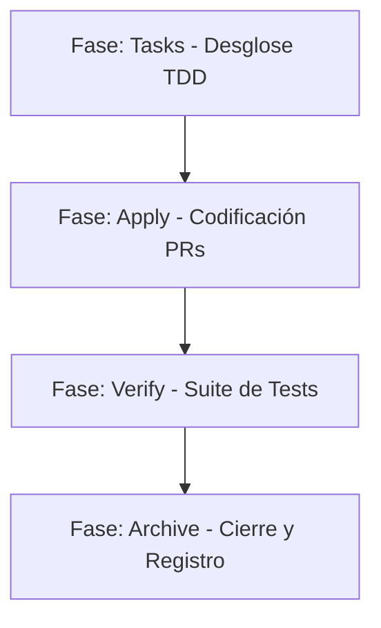

# Contexto de Desarrollo y Mapa Arquitectónico Completo (EC-Antigravity)
**Fecha de actualización:** 03 de Junio de 2026
**Proyecto en Memoria Engram:** `financieranuevo` (EC-Antigravity, Laravel 12 + Filament 3.3, MySQL, Pest, STRICT TDD)
**Objetivo de este documento:** Proveer contexto técnico hiperdetallado, firmas de métodos, entidades y reglas de negocio para agentes de IA de código y desarrolladores del equipo.

---

## 1. Filosofía Arquitectónica y Reglas de Oro
*   **CONCEPTOS > CÓDIGO:** No se permiten parches acumulativos ni "bridges" temporales sobre código legacy mal escrito. Si una funcionalidad viola SOLID, se reescribe con principios limpios. El desarrollador profesional domina la arquitectura subyacente antes de picar teclas.
*   **STRICT TDD (Test-Driven Development):** El modo Strict TDD está habilitado. Se escribe primero el test que falla (RED) en Pest 4, luego el código que lo hace pasar (GREEN) y finalmente se refactoriza.
*   **Precisión Financiera:** Toda operación de cálculo monetario (saldos, intereses, amortizaciones, mora y penalizaciones) debe utilizar la extensión **BCMath** (`bcadd`, `bcsub`, `bcmul`, etc.) para evitar inconsistencias de redondeo flotante de la CPU.
*   **Eventos de Dominio Diferidos:** Los listeners y manejadores de eventos que afecten al flujo transaccional deben despacharse **fuera** de las transacciones principales de base de datos (`$afterCommit = true`) para que los fallos de notificación o auditoría no reviertan operaciones de negocio principales.

---

## 2. Mapa Completo de Dominios y Entidades

El sistema de microfinanzas grupales está modelado bajo las siguientes capas y modelos en `app/Models/`:

1.  **Identidad y Accesos (Auth/Spatie):**
    *   `User`: Modelo de usuario del sistema.
    *   `Persona`: Datos demográficos (nombre, apellido, documento, etc.) asociados a clientes y usuarios.
    *   `Asesor`: Representa al oficial de crédito en campo. Relacionado con `User` y `Persona`.
2.  **Productos de Crédito:**
    *   `ProductoFinanciero`: Define tasas, penalizaciones y plazos de productos individuales (ej. **CI-EMPRENDEDOR**) y grupales.
3.  **Clientes y Grupos:**
    *   `Grupo`: Unidad de negocio colectiva (con `numero_integrantes` y `asesor_id`).
    *   `Cliente`: Miembro de un grupo o deudor individual.
    *   `GrupoCliente` (Pivot): Tabla relacional con control de historial de membresía (`fecha_ingreso`, `fecha_salida`).
4.  **Préstamos y Amortizaciones:**
    *   `Prestamo`: Registro del contrato financiero general. Posee una máquina de estados (FSM):
        `Pendiente` ──> `Aprobado` ──> `Firmado` ──> `Activo` ──> `Al_Día` / `En_Mora` ──> `Finalizado`.
        *(Nota: los estados legacy `Por Desembolsar` y `Desembolsado` están obsoletos).*
    *   `PrestamoIndividual`: Desglose individual de un préstamo grupal (coexisten 4-6 por grupo; o 1 para préstamos individuales).
    *   `CuotasGrupales`: Amortizaciones de grupo (unificadas).
    *   `CuotaIndividual`: Amortizaciones asignadas a cada cliente individualmente.
5.  **Pagos y Caja:**
    *   `Pago`: Registro del dinero recaudado (estados: `pendiente`, `aprobado`, `rechazado`).
    *   `AplicacionPago`: Registro de asignación proporcional del pago sobre el capital, interés y mora de una `CuotaIndividual`.
    *   `Mora`: Registro de atrasos calculados dinámicamente o congelados.
    *   `AjusteDeuda`: Historial operativo de condonación de mora o reestructuraciones de saldo.
6.  **Flujos Operativos Complejos:**
    *   `Retanqueo`: Refinanciación de deuda (solo elegible si queda **exactamente 1 cuota pendiente**).
    *   `RetanqueoIndividual`: Registro específico de los integrantes del grupo que optan por refinanciar.
    *   `SeparacionCliente`: Aislamiento de la deuda de un integrante moroso de un préstamo grupal hacia un préstamo individual nuevo.
    *   `Reagrupacion`: Traspaso de clientes entre grupos.
    *   `ReagrupacionCliente` (Pivot): Registra si un cliente fue `trasladado` o `retenido`.

---

## 3. Catálogo de Servicios y Firmas de Código

La lógica de negocio reside estrictamente en el namespace `app/Domain` (capa de aplicación/dominio) y `app/Infrastructure` (capa de servicios externos e infraestructura):

### A. Dominio de Pagos (`app/Domain/Pagos/PagoService.php`)
Implementa `App\Contracts\PagoServiceInterface`. Administra el ledger de pagos en partida doble:
*   `aprobarPago(Pago $pago): Pago`
    *   Ejecuta en una transacción de base de datos (`DB::transaction`) con bloqueo de fila (`lockForUpdate`).
    *   Distribuye el monto pagado priorizando cubrir moras vencidas primero y luego cuotas activas.
    *   Crea los registros de `Ingreso` y `AplicacionPago` invocando internamente a `distribuirEnCuotasIndividuales()`.
    *   Despacha el evento `PagoAprobado` y actualiza el estado de la cuota colectiva.
*   `distribuirEnCuotasIndividuales(Pago $pago, CuotasGrupales $cuotaGrupal, float $montoCuota, float $montoMora): void`
    *   Distribuye los montos proporcionalmente entre todas las `CuotaIndividual` asociadas que tengan estado diferente a `pagada`. Cubre interés primero y luego capital.
*   `rechazarPago(Pago $pago): Pago`
    *   Marca el estado como `rechazado` y libera los saldos pendientes.
*   `revertirPago(Pago $pago): bool`
    *   Restaura los saldos originales en `CuotaIndividual` basándose en las `AplicacionPago` activas, elimina las aplicaciones, crea un ingreso negativo de corrección y restablece la mora.
*   `registrarCanonico(Prestamo $prestamo, float $monto, ...): Pago`
    *   Registra un pago directo y lo distribuye a través de todas las cuotas individuales pendientes en orden FIFO por `numero_cuota` sin depender de una cuota grupal.

### B. Separación de Morosos (`app/Domain/Grupos/MorosoSeparationService.php`)
Implementa `App\Contracts\SeparacionServiceInterface` (reemplaza al antiguo `SeparacionClienteService`):
*   `separar(int $prestamoOrigenId, int $clienteId, int $ejecutadoPorId, string $motivo): SeparacionCliente`
    *   **Flujo transaccional de 12 pasos:**
        1. Lock de fila del préstamo origen (`lockForUpdate`).
        2. Validar que el estado del préstamo sea activo y no sea un préstamo individual.
        3. Validar membresía activa del cliente en el grupo.
        4. Validar idempotencia (evitar doble separación del mismo cliente).
        5. Validar que el grupo mantenga al menos 2 integrantes después del retiro.
        6. Cargar y bloquear las cuotas individuales pendientes del moroso.
        7. Calcular la deuda consolidada (capital, interés y mora) con BCMath.
        8. Calcular la penalización sobre el grupo según la tasa del producto.
        9. Crear un nuevo modelo `Prestamo` con estado `Separado` y tipo `individual`.
        10. Reasignar las `CuotaIndividual` del moroso al nuevo préstamo individual.
        11. Reducir los saldos de `CuotasGrupales` del préstamo origen usando `bcsub` (verificar invariante $\ge 0$).
        12. Actualizar el estado del pivot del cliente a `separado`, registrar la fecha de salida y decrementar `grupo.numero_integrantes`.
        13. Insertar el registro de auditoría en `SeparacionCliente` y despachar `SeparacionRealizada` post-commit.

### C. Reagrupación Parcial (`app/Domain/Prestamos/ReagrupacionParcialService.php`)
*   `reagrupar(Prestamo $prestamo, array $clientesTrasladadosIds, string $tipo, string $observaciones): Reagrupacion`
    *   Crea un nuevo grupo, traslada físicamente a los clientes marcándolos en la tabla pivot `reagrupacion_cliente` como `trasladado` y a los restantes como `retenido`.
    *   Calcula el descuento de retanqueo proporcional: `saldo_pendiente × (cantidad_trasladados / total_integrantes)` y despacha `ReagrupacionEjecutada`.

---

## 4. Trazabilidad y Spine de Auditoría (Diseño por Aplicar)

Se ha diseñado un esquema de auditoría no-repudiable en base de datos para impedir que los agentes de código o usuarios manipulen logs históricos (`trazabilidad-modelo-datos`):

### A. Estructura de `audit_logs` (Ledger Inmutable)
La tabla cuenta con la siguiente estructura de cadena enlazada (hash-chain):
*   `canal`: `ENUM('web', 'movil', 'sistema')`
*   `user_agent`: `VARCHAR(512)`
*   `hash_prev`: `CHAR(64) NULL` (referencia al SHA-256 del registro anterior en base a su `id`).
*   `hash_self`: `CHAR(64) UNIQUE` (SHA-256 generado en la aplicación al guardar el log).
*   **Fórmula del hash:** `hash_self = sha256(hash_prev || canonical_json(payload))`
*   *Canonical JSON:* Generado recursivamente ordenando llaves alfabéticamente (`ksort`), codificación UTF-8, formateando marcas de tiempo en formato ISO-8601 UTC microsegundos, y omitiendo espacios en blanco.

### B. Triggers de Seguridad en MySQL
La migración de trazabilidad instalará los siguientes triggers en la base de datos MySQL para evitar mutaciones directas desde el motor:
```sql
CREATE TRIGGER audit_logs_no_update BEFORE UPDATE ON audit_logs
FOR EACH ROW SIGNAL SQLSTATE '45000' SET MESSAGE_TEXT = 'audit_logs is append-only';

CREATE TRIGGER audit_logs_no_delete BEFORE DELETE ON audit_logs
FOR EACH ROW SIGNAL SQLSTATE '45000' SET MESSAGE_TEXT = 'audit_logs is append-only';
```
*(Nota: Para limpiar datos en el entorno de pruebas, Pest ejecutará `TRUNCATE` o `RefreshDatabase` (que recrea las tablas vía DDL), ya que los triggers solo bloquean sentencias DML `UPDATE` y `DELETE` individuales).*

### C. Normalización XOR de Préstamos
A fin de asegurar consistencia en la relación `cliente_id` y `grupo_id` en la tabla `prestamos`:
*   Se aplicará un check a nivel motor base de datos:
    `ALTER TABLE prestamos ADD CONSTRAINT chk_prestamos_grupo_xor_cliente CHECK ((grupo_id IS NOT NULL AND cliente_id IS NULL) OR (grupo_id IS NULL AND cliente_id IS NOT NULL));`
*   El modelo `Prestamo` contará con un validador en el hook `saving` para capturar esta violación de consistencia antes de enviarla a la base de datos.

---

## 5. Historial Detallado de SDD Implementados (Fase por Fase)

A continuación se detalla la traza cronológica y los entregables de diseño/código correspondientes a cada fase de los SDD ejecutados:

### SDD 1: `sdd/data-layer-asesor` (Cerrado y Archivado)
*   **Proposal (Propuesta):** Definir la capa de datos optimizada para las vistas de métricas del rol Asesor en Laravel 12 + Filament v3.
*   **Explore (Exploración):** Inspección de consultas N+1 en el listado de clientes de asesores y validación de las tablas de moras activas.
*   **Specification (Especificación - #76):** Determinar qué cálculos de morosidad, capital colocado e integrantes activos deben generarse de forma reactiva y qué otros mediante jobs nocturnos.
*   **Design (Diseño - #74):** Creación de 3 tablas métricas y 1 migración de índice, creación de 3 nuevos modelos, definición de scopes en 4 modelos existentes y estructuración de 2 servicios de caché.
*   **Tasks (Tareas - #77):** Checklist de 15 tareas secuenciales de desarrollo y testing bajo TDD.
*   **Apply (Aplicación - #78):** Implementación del código en un único PR (*single-pr*), cerrando las 15 tareas y validando la consistencia transaccional.
*   **Verify (Verificación - #80):** Ejecución de 18 pruebas unitarias en limpio (5 Unit y 3 Feature) con Pest.
*   **Archive (Archivo - #81):** Generación del reporte final de cierre para iniciar el desarrollo de la capa de interfaz.

### SDD 2: `sdd/filament-views-asesor` (Cerrado y Archivado)
*   **Proposal / Spec (#94):** Diseñar e implementar dos páginas interactivas en Filament (`Panel Diario` y `Dashboard Cartera`) que sean accesibles y contextuales para Asesores, Jefes de Operaciones y Jefes de Crédito.
*   **Design (#87):** Definición del patrón `resolveAsesor($user)` en los controladores de vistas y estructuración de queries optimizadas y restringidas por rol.
*   **Apply (#89):** Codificación y despliegue del flujo mediante ramas encadenadas (*feature-branch-chain* con 2 PRs: `asesor-page-slice` y `asesor-dashboard-slice`), completando 19 tareas.
*   **Archive (#93):** Cierre y archivo exitoso tras la validación de despliegue local.

### SDD 3: `sdd/services-domain` (Cerrado y Archivado)
*   **Proposal (#114):** Reestructurar el directorio plano e inconsistente de `App\Services` (20 archivos) hacia namespaces de dominio y corregir el bug crítico de doble escritura en pagos.
*   **Explore (#113):** Auditoría estática que descubrió que tanto `PagoObserver` como `PagoService` generaban de forma paralela registros duplicados de `AplicacionPago` para una misma cuota.
*   **Specification (#115):** Exigir un único punto de entrada transaccional y la eliminación definitiva de la lógica FIFO en `PagoObserver`.
*   **Design (#116):** Plan de refactorización modular dividida en 4 PRs encadenadas (*stacked-to-main*).
*   **Apply (#119):** Remoción física de los métodos observer conflictivos y redirección del flujo de aprobación hacia `PagoService`.
*   **Archive (#121):** Generación del reporte e indexación en el engram de la corporación.

### SDD 4: `sdd/domain-phase2` (Cerrado y Archivado)
*   **Fases Completas (Consolidado en #137):** Cierre del backlog diferido de reorganización de dominio. Incluyó la separación física de `RetanqueoService` en clases de Workflow y Query, la normalización de eventos de dominio (`PagoRevertido`, `ReagrupacionEjecutada`) y la inyección del prefijo `/v1/` en la API REST de compatibilidad.

### SDD 5: `sdd/performance-optimization` (Cerrado y Archivado)
*   **Fases Completas (Consolidado en #176):** Análisis y remediación en caliente de consultas lentas en base de datos. Se implementaron 8 optimizaciones quirúrgicas (eager loading masivo de relaciones y adición de índices compuestos en tablas pivote de grupos y cuotas).

### SDD 6: `modelo-financiero-v2` (Cerrado y Archivado)
*   **Proposal (#7):** Resolver la coexistencia sin puente entre el esquema legacy de cuotas grupales y las cuotas individuales de integrantes.
*   **Explore (#5):** Confirmar en código la ausencia de un ledger transaccional en la distribución de pagos y las constantes deprecated de préstamos.
*   **Design (#9):** Diseño de la migración incremental para la remoción de columnas redundantes, unificación de saldos en `CuotaIndividual` y plan de datos de seeders para desarrollo.
*   **Tasks (#10):** Checklist de tareas bajo estricto TDD (RED $\rightarrow$ GREEN).
*   **Apply (#190):** Batch 1 de aplicación: reescritura de seeders, configuración del entorno local `EC-dev` y reconciliación de `SeparacionService`.
*   **Verify (#191):** Validación completa. Ejecución exitosa de `migrate:fresh --seed` y paso de la suite completa de Pest.
*   **Archive (#192):** Archivo y cierre formal en el commit `a4e637e`.

---

## 6. La Gran Refactorización de la Capa de Servicios (Namespaces y DI)

Una de las transformaciones estructurales más importantes del proyecto fue el saneamiento de la capa `App\Services\`, la cual presentaba alto acoplamiento y dependencias estáticas difíciles de testear.

### A. El Problema Original
La carpeta `App\Services` contenía más de 20 archivos en un espacio plano que mezclaban lógica de negocio, reglas de infraestructura (como llamadas directas a cache o loggers) y consultas CRUD rápidas. Además, el abuso de fachadas estáticas impedía la inyección de dependencias (DI) tipada, bloqueando la capacidad de mockear servicios en las pruebas unitarias.

### B. Solución Implementada: Namespaces de Dominio
Se separaron las responsabilidades encapsulando la lógica de negocio en subdirectorios organizados por dominios en `app/Domain/`:
*   `app/Domain/Prestamos/`: Contiene `CronogramaService` (cálculo de cuotas) y `RetanqueoService` (desacoplado en query/workflow mediante el patrón Strategy).
*   `app/Domain/Pagos/`: Contiene `PagoService` (amortización proporcional) y `CondonacionMoraService`.
*   `app/Domain/Grupos/`: Contiene `CicloService` y `MorosoSeparationService` (transacciones ACID de separación).
*   `app/Domain/Cartera/`: Contiene `CarteraService` (métricas de colocación) y `ReasignacionCarteraService`.
*   `app/Domain/Shared/`: Contiene `BusinessRuleService`.

### C. Abstracción de Infraestructura e Inyección de Dependencias
Los servicios que consumen APIs o recursos del framework se aislaron en `app/Infrastructure/` y se vincularon mediante interfaces en `app/Contracts/` para posibilitar el mockeo en Pest:
1.  **Caché:** Se extrajo `CacheServiceInterface` y se refactorizó `CacheService` para implementar sus 18 métodos como métodos de instancia.
2.  **Notificaciones:** Se extrajo `NotificationServiceInterface` para independizar el canal de envío.
3.  **Binding en Contenedor:** Se registraron en `AppServiceProvider` mediante inyección DI:
    ```php
    $this->app->singleton(CacheServiceInterface::class, CacheService::class);
    $this->app->singleton(NotificationServiceInterface::class, NotificationService::class);
    ```
4.  **Consumo de Interfaces (Estrategia A y B):**
    *   *Categoría A (DI por Constructor):* Para servicios de dominio y controladores que se instancian a través del contenedor (ej. `__construct(CacheServiceInterface $cache)`).
    *   *Categoría B (Resolución Dinámica):* Para recursos y páginas Filament/Livewire que no toleran DI en constructor por su ciclo de vida, resolviéndose vía `app(CacheServiceInterface::class)`.

### D. Patrón Strategy en el Motor de Moras
Se eliminó la fórmula hardcoded de mora tanto a nivel grupal como individual. El cálculo se abstrajo con el patrón Strategy (SDD `dominio-pagos-mora-retanqueo`, Eje 2):
*   `App\Domain\Mora\Strategies\MoraCalculationStrategy`: Interfaz del motor de cálculo (recibe un `MoraCalculoInput`).
*   `MoraFlatPorIntegranteStrategy`: Implementación por defecto para productos grupales (S/1 diario por integrante).
*   `MoraPorcentualSobreSaldoStrategy`: Estrategia por defecto para productos individuales (porcentaje sobre saldo de capital vía `tasa_mora`).
*   `ProductoFinanciero::moraStrategy()`: Resuelve la estrategia según la columna `tipo_calculo_mora` del producto (con fallback por `tipo` grupal/individual si no está configurada). `Mora::calcularMontoMora()` y `CuotaIndividual::moraCalculada()` delegan a esta resolución en vez de tener la fórmula inline.

(Nota: existió un scaffold previo no conectado en `app/Services/Mora/*`, nunca referenciado fuera de sí mismo — se eliminó en el Eje 6 de cleanup por quedar superseded por la implementación arriba.)

### E. Desacoplamiento mediante Eventos de Dominio
Se introdujeron eventos de dominio (`PagoAprobado`, `PagoRevertido`, `PrestamoAprobado`, `ReagrupacionEjecutada`, `SeparacionRealizada`) despachados con la opción `$afterCommit = true`. Esto garantiza que los listeners secundarios de auditoría (`AuditListener`) o mensajería se ejecuten únicamente después de que la transacción SQL principal se haya completado con éxito, evitando que un error en el envío de una notificación provoque el rollback de un pago aprobado en el core del sistema.

---

## 7. Historial de Commits Significativos
El repositorio cuenta con la siguiente secuencia ordenada de cambios implementados en la rama principal:

*   **`e128294`** `refactor(dashboard): organize sidebar navigation into explicit groups` (Último cambio).
*   **`c9c4bc2`** `fix(permissions): assign Shield nav permissions to JC, JO, Asesor`
*   **`a4e637e`** `feat(seeders): rewrite seeders for dev DB EC-dev, add SeparacionService convenience method` (Normalización del entorno de desarrollo).
*   **`b204807`** `fix(security): update league/commonmark to >=2.8.2, vite to patched version — zero audit advisories`
*   **`6e93541`** `feat(ui): responsive layout, motion system, and mobile UX for Filament dashboard`
*   **`b5ebec0`** `perf(db): add composite index cuota_individual(prestamo_id, estado)` (Optimización de lectura de cartera).
*   **`6b2ed59`** `perf: bound notification queries, cache supervisor list, fix N+1 lookups and bulk actions`
*   **`ffd8844`** `feat(contracts): extract CacheServiceInterface and convert CacheService to injectable` ( SOLID refactoring).
*   **`eb58123`** `feat(api): add /v1/ route prefix with legacy aliases`
*   **`9510187`** `feat(domain): split RetanqueoService into Query/Workflow/Ejecucion + Strategy pattern`
*   **`5364963`** `feat(events): PrestamoAprobado, PrestamoRechazado, ReagrupacionEjecutada domain events`
*   **`7f1a469`** `feat(architecture): move services to Domain and Infrastructure namespaces`

---

## 8. Skills del Sistema Aplicadas
Durante el desarrollo del proyecto se han implementado diversas habilidades y patrones especializados para garantizar la robustez del software:

*   **`laravel-clean-architecture` & `laravel-solid-principles`**: 
    *   *Aplicación:* Los servicios fueron reorganizados bajo los namespaces `App\Domain` y `App\Infrastructure`.
    *   *Ejemplo:* Extracción de `CacheServiceInterface` y `NotificationServiceInterface` convirtiendo los servicios concretos en inyectables en el contenedor de servicios de Laravel, desacoplándolos de fachadas estáticas globales. Separación de la lógica del flujo de retanqueo en `RetanqueoService` aplicando el patrón Strategy.
*   **`laravel-event-driven-architecture`**:
    *   *Aplicación:* Implementación de eventos de dominio desacoplados (`PagoAprobado`, `PagoRevertido`, `PrestamoAprobado`, `PrestamoRechazado`, `ReagrupacionEjecutada`, `SeparacionRealizada`) para notificaciones y flujos de auditoría diferidos. Se eliminó la doble auditoría en `CondonacionMoraService` delegando en listeners asíncronos.
*   **`pest-testing` (Strict TDD)**:
    *   *Aplicación:* Diseño e implementación de pruebas unitarias y de integración rigurosas (`PagoTest`, `MoraTest`, `PrestamoIndividualEstadoTest`). Todo flujo de negocio se escribe siguiendo el ciclo **Rojo → Verde → Refactorizar**, garantizando cobertura antes de escribir el código de producción.
*   **`laravel-best-practices`**:
    *   *Aplicación:* Remediación de consultas N+1 en las tablas y vistas Filament de `Grupo`, `Pago` y `Prestamo` usando eager loading, ordenamiento explícito y control de carga en menús laterales.
*   **`laravel-security`**:
    *   *Aplicación:* Inyección de cabeceras de seguridad HTTP a nivel global mediante `SecurityHeadersMiddleware` y resolución de advertencias críticas en dependencias de Composer y Node.js.
*   **`work-unit-commits` & `chained-pr`**:
    *   *Aplicación:* División de cambios complejos en ramas independientes de bajo volumen (bajo el límite seguro de 400 líneas de código modificadas por PR) y uso sistemático de Conventional Commits.

---

## 9. Metodología de Trabajo: Fases SDD (Spec-Driven Development)
Para implementar cualquier cambio de media o alta complejidad, seguimos rigurosamente el pipeline de SDD. Las fases se ejecutan de manera secuencial para asegurar que no haya desviaciones de lógica:

```
[Proposal] ──> [Explore] ──> [Specification] ──> [Design] ──> [Tasks (TDD)] ──> [Apply] ──> [Verify] ──> [Archive]
```

1.  **Proposal (Propuesta):** Declaración del problema a resolver, la motivación del negocio y el impacto inicial del cambio.
2.  **Explore (Exploración):** Auditoría estática y dinámica del código vivo para validar supuestos de base de datos o lógica de negocio.
3.  **Specification (Especificación):** Definición detallada de *qué* debe ser verdad al terminar la tarea (las reglas del sistema, no los detalles del código).
4.  **Design (Diseño):** Definición técnica detallada de *cómo* estructurar el cambio (esquemas ERD, firmas de clases, migraciones e interacciones).
5.  **Tasks (Tareas de Desarrollo):** Creación del checklist de tareas detalladas con enfoque TDD (escribir el test que falla antes de programar).
6.  **Apply (Aplicación):** Implementación de los commits estructurados e informe de progreso periódico en el archivo `apply-progress`.
7.  **Verify (Verificación):** Comprobación final. Ejecución de la suite completa de pruebas unitarias e integración en limpio (`migrate:fresh --seed` OK).
8.  **Archive (Archivo):** Generación del reporte de cierre (`archive-report`) detallando los entregables y el hash del commit final antes de fusionar.

---

## 10. Gotchas y Errores Históricos Resueltos

*   **Bug de Doble Escritura en Pagos:** 
    Originalmente, tanto `PagoObserver::aplicarPagoACuotasIndividuales()` (FIFO) como `PagoService` (proporcional) creaban registros en `AplicacionPago` cuando un pago era aprobado. Se eliminó la lógica FIFO del observer y se consolidó el flujo a través de `PagoService` como único punto de entrada canónico.
*   **Ausencia de Base de Datos de Desarrollo:**
    Anteriormente, el sistema no poseía seeders integrales para levantar un ambiente limpio de pruebas de integración local. Esto fue solucionado en `a4e637e` mediante la unificación de seeders sobre la base de datos `EC-dev`.
*   **Casing de Estados en Préstamos:**
    Los estados se guardan en la base de datos como strings simples sin cast de tipo. Sin embargo, hay lógica que compara estados con mayúsculas (`ACTIVO`) y minúsculas (`Activo`). El plan de trazabilidad normalizará los estados a minúsculas (`snake_case`) usando un enum respaldado (`EstadoPrestamo`).

---

## 11. Próximos Pasos Técnicos para el Equipo
1.  **Auditoría de Código Viva (Fase 0):** Validar si la columna `cliente_id` ya existe en la base de datos real y constatar si la página `/moras` sigue disparando updates masivos y no idempotentes en base de datos al realizar el render (en `app/Filament/Dashboard/Pages/Moras.php`).
2.  **Mover el cálculo de moras a consola:** Extraer la lógica de actualización masiva del renderizador de Filament de Moras y encapsularla en un comando de Artisan programado (`app/Console/Commands/ActualizarMorasCommand.php`).
3.  **Implementar Migraciones de `trazabilidad-modelo-datos`:**
    *   Agregar `cliente_id` nullable a `prestamos` con check XOR.
    *   Migrar `asesor_id` en `metas_mensuales` y `metricas_diarias_asesor` para que apunte a `asesores.id` en lugar de `users.id`.
    *   Crear la estructura del hash-chain en `audit_logs` junto con sus triggers de base de datos.
4.  **Generar el servicio de auditoría inmutable:** Construir `App\Domain\Audit\AuditHashService` con los métodos `canonicalize(array $payload)` y `verifyChain(): ChainReport`.

---

## 12. Justificación del Diseño del Modelo de Datos (El "Porqué")

Para construir sobre este sistema sin romper la consistencia financiera, es imperativo comprender la motivación técnica detrás de cada decisión estructural del diseño actual:

### 1. El Ledger de Pagos Desacoplado (`AplicacionPago` ──> `CuotaIndividual`)
*   **El Problema Legacy:** Existían dos esquemas de cuotas en paralelo (`cuotas_grupales` y `cuotas_individuales`) que se actualizaban mediante flujos distintos. Esto causaba "descuadres fantasma": un cliente pagaba su parte, el grupo se registraba como al día, pero las cuotas individuales no reflejaban el abono o lo hacían de manera asincrónica e inconsistente.
*   **La Solución de Diseño:** La única verdad física de la deuda reside en la sumatoria de las `cuotas_individuales` (el ledger atómico). La tabla `cuotas_grupales` es únicamente una proyección de agregación de lectura para la vista consolidada de cobranza del grupo.
*   **Por qué `AplicacionPago`:** Cada centavo que ingresa debe tener trazabilidad. No basta con hacer un `UPDATE` en el saldo de la cuota. `AplicacionPago` actúa como la partida doble: explica con precisión cuántos centavos del pago se destinaron a amortizar el capital, cuántos al interés y cuántos a la mora acumulada de un deudor específico. Esto permite revertir pagos de forma limpia y transparente sin corromper el histórico de saldos.

### 2. El Spine Inmutable de Auditoría (`audit_logs` enlazado con SHA-256)
*   **Por qué no usar paquetes estándar (ej. Spatie ActivityLog):** Los paquetes convencionales guardan registros que cualquier usuario con acceso `root` a la base de datos (o inyección SQL) puede alterar o eliminar para encubrir fraudes o fallos operativos en el desembolso y cobranza.
*   **Por qué el Hash-Chain:** Al enlazar cada log con el hash del log anterior (`hash_self = sha256(hash_prev || payload)`), se crea un ledger criptográficamente verificable. Si un registro intermedio es alterado o eliminado, la cadena se rompe inmediatamente desde ese ID hacia adelante. Esto garantiza la propiedad de **no-repudiación** indispensable en un sistema financiero de microcréditos.
*   **Por qué triggers a nivel motor MySQL:** La seguridad de la aplicación es la primera línea de defensa, pero la base de datos es la última. Al inyectar un trigger que bloquea físicamente comandos DML `UPDATE` y `DELETE` sobre `audit_logs`, se mitiga la posibilidad de sabotaje directo sobre los registros de auditoría por parte de desarrolladores o scripts automáticos.

### 3. Redundancia Controlada en Traspasos (`reasignacion_cartera`)
*   **El Problema de Rendimiento:** Analizar el historial de reasignaciones de cartera (qué asesores manejaron a qué clientes y cuándo) consultando directamente los payloads JSON dentro de `audit_logs` es computacionalmente prohibitivo para generar listados interactivos o reportes en Filament.
*   **La Solución de Diseño (CQRS Simplificado):** Se escribe en dos destinos. La tabla `reasignacion_cartera` es un modelo estructurado optimizado para lecturas rápidas e indexadas. El log de auditoría es la fuente inmutable de validación. Si existe alguna discrepancia o sospecha de corrupción en la tabla indexada, la verdad definitiva se reconstruye auditando el hash-chain criptográfico.

### 4. Mecanismo de Aislamiento en Separación de Morosos
*   **Por qué un préstamo individual nuevo:** Cuando un integrante de un préstamo grupal deja de pagar de forma sistemática, su mora empieza a arrastrar el indicador de salud financiera de todo el grupo, penalizando a los integrantes que sí están al día y bloqueando sus futuros desembolsos.
*   **Por qué el prorrateo de cuotas colectivas:** En lugar de deshacer el préstamo grupal y crear contratos nuevos para todos, el servicio aísla únicamente la porción de deuda correspondiente al moroso (capital + interés acumulado) y la transfiere a un nuevo contrato individual independiente. El préstamo grupal origen reduce su saldo colectivamente mediante fórmulas proporcionales de `bcsub`, permitiendo al grupo continuar su amortización original sin penalizaciones injustas.

---

## 13. Funcionalidades Pendientes por Implementar

Para las próximas iteraciones de desarrollo, se deben implementar las siguientes metas funcionales:

1.  **Cálculo e Historial Automático de Moras (Command + Scheduler):**
    *   *Objetivo:* Crear el comando Artisan `moras:actualizar` que se ejecute en el cron scheduler diariamente a las 00:00. 
    *   *Comportamiento:* Recorrerá los préstamos activos, detectará cuotas individuales vencidas, calculará el monto de mora usando `ProductoFinanciero::moraStrategy()` (ver sección D) e insertará o actualizará los registros en la tabla `moras`. La página de Filament `Moras` leerá de esta tabla en modo lectura estricta, eliminando toda mutación en tiempo de render.
2.  **Verificación Criptográfica del Log de Auditoría:**
    *   *Objetivo:* Implementar el comando `auditoria:verificar-cadena` que recorra la tabla `audit_logs` ordenada secuencialmente, recalcule los hashes SHA-256 usando el servicio `AuditHashService` y detecte si algún registro intermedio ha sido modificado o eliminado manualmente en la base de datos.
3.  **Módulo UI de Reasignación en Lote de Cartera:**
    *   *Objetivo:* Proveer en Filament (dentro de `ClienteResource` y `GrupoResource`) una acción en lote (*Bulk Action*) exclusiva para roles jerárquicos (Jefe de Operaciones / Jefe de Crédito) que permita reasignar múltiples clientes/grupos a un nuevo Asesor Destino en una sola transacción, disparando el registro operativo en `reasignacion_cartera` y auditando el evento en el ledger inmutable.
4.  **Soporte Pleno de Créditos Individuales:**
    *   *Objetivo:* Integrar el producto **CI-EMPRENDEDOR** en el flujo operativo. Los asesores podrán crear préstamos de tipo individual que cuenten con exactamente una relación `cliente_id` (y `grupo_id` nulo), mapeando una sola línea de `prestamo_individual` y validando la integridad del producto financiero a nivel de servicio.
5.  **Políticas de Autorización Tipadas (Policies):**
    *   *Objetivo:* Sustituir las validaciones inline basadas en closures en los Filament Resources por clases Policy tradicionales de Laravel (`PrestamoPolicy`, `PagoPolicy`, `RetanqueoPolicy`). Esto permitirá testear el control de acceso en aislamiento bajo la suite de Pest sin necesidad de bootear el ecosistema Filament completo.

---

## 14. Detalle de las Fases SDD Faltantes (Roadmap de Trabajo)

Para el cambio `trazabilidad-modelo-datos` que se encuentra en estado *Design Complete*, el equipo debe proceder con la ejecución de las fases restantes del ciclo SDD:



### Fase 4: Tasks (Desglose de Tareas en Estricto TDD)
En esta fase, se desglosa el diseño en una lista de tareas de desarrollo atómicas. Cada tarea debe programarse siguiendo el flujo TDD (Rojo $\rightarrow$ Verde $\rightarrow$ Refactor):
*   *Paso 1 (RED):* Escribir un test en Pest 4 que describa el comportamiento deseado (ej. que un `UPDATE` en `audit_logs` lance la excepción `QueryException` de base de datos con código SQLSTATE 45000). El test debe fallar inicialmente.
*   *Paso 2 (GREEN):* Escribir la migración o código mínimo necesario para que el test pase.
*   *Paso 3 (REFACTOR):* Limpiar el código sin alterar el comportamiento verificado.

### Fase 5: Apply (Codificación y Pull Requests Encadenadas)
*   Se inicia la creación de ramas secundarias basadas en el tracker principal `feature/trazabilidad-modelo-datos`.
*   Para evitar superar el presupuesto de revisión de **400 líneas de código**, la implementación se dividirá en PRs encadenadas (*Chained PRs*):
    *   **PR1 (Eje 0 - Estructura):** Migraciones de base de datos (`M1` a `M3`), añadiendo columnas y triggers.
    *   **PR2 (Eje 1 - Backend & Hashes):** Implementación de `AuditHashService` y pruebas del ledger encriptado.
    *   **PR3 (Eje 2 - Servicios de Dominio):** Implementación de `ReasignacionCarteraService` y refactorización de Filament Resources.
    *   **PR4 (Eje 3 - Políticas):** Implementación de Laravel Policies y limpieza de closures inline.

### Fase 6: Verify (Verificación Rigurosa)
*   **Prueba de Integridad de la Base de Datos:** Correr localmente `php artisan migrate:fresh --seed` en el ambiente `EC-dev` y verificar que el seed inicial genere la base criptográfica del hash-chain con un reporte de verificación exitoso.
*   **Suite de Tests Completa:** Ejecutar `./vendor/bin/pest` asegurando un resultado de 100% pasando (cero warnings).
*   **Pruebas Manuales de Integridad:** Intentar realizar modificaciones directas en la tabla `audit_logs` mediante cliente SQL local para certificar que los triggers de MySQL bloquean la acción.

### Fase 7: Archive (Cierre y Registro)
*   Generar el reporte final `archive-report` documentando las desviaciones menores aceptadas durante la codificación y registrando los IDs de los artefactos en Engram.
*   Fusionar la rama tracker a `main` y registrar el hash del commit de fusión para dar por concluido el ciclo SDD.

---

## 15. Cerebro Local y Guía de Refinamiento de Comportamiento para IAs de Desarrollo

Esta sección actúa como las directivas del sistema e instrucciones de comportamiento que **toda IA de codificación (agente de desarrollo) debe obedecer de forma estricta** cuando sea asignada a este repositorio:

### A. Restricciones del Framework e Interfaces de Usuario
*   **Filosofía de Render de Pestañas e Interfaces:** Bajo Filament v3, Livewire v3 y Alpine.js, los cambios puramente visuales (como el cambio de tabs en layouts, modales o filtros visuales de UI) **no deben forzar roundtrips al servidor**. El patrón obligatorio es utilizar Alpine.js para interactividad local y enlazar el estado de forma diferida usando `$wire.entangle('activeTab')`. Esto previene regresiones en el rendimiento móvil.
*   **No Versionar la API del MVP Móvil:** La API se expone directamente en `/api/` en el backend Laravel único (monolito) sin prefijo `v1`. No construyas clases, controladores o rutas agrupadas bajo `Api/V1/` a menos que se deba interactuar con legacy. El plan de refactorización apunta a un `/api/` plano y limpio.

### B. Pruebas de Software e Integración de Datos
*   **Base de Datos Nativa de Pruebas:** Bajo ninguna circunstancia se debe configurar SQLite en memoria como fallback de la suite de pruebas en `phpunit.xml`. El diseño del sistema utiliza triggers nativos de MySQL (`BEFORE UPDATE` y `BEFORE DELETE` con bloqueos `SIGNAL SQLSTATE`). SQLite no soporta esta sintaxis relacional, por lo que las pruebas de integración fallarían de forma errónea. La base de datos de test y desarrollo debe ser estrictamente MySQL (`EC-dev` o similar).
*   **Aislamiento de la Lógica de Autorización:** No declares permisos inline, closures o condicionales que evalúen `request()->user()` dentro de los Filament Resources. Mueve toda la lógica de validación a políticas de Laravel (`app/Policies/`) estructuradas, consistentes y testeables de forma independiente.

### C. Visión del Producto y Objetivos de la Tesis Académica
*   **Ecosistema de Microcréditos Abierto:** La visión a largo plazo del proyecto es servir como una plataforma abierta (*Open-Source*) fintech para empresas de microcréditos en Latinoamérica. La arquitectura de datos prioriza la integridad matemática y el no-repudiamiento.
*   **Caso de Estudio de Integridad Financiera:** La tesis del usuario evalúa "Garantías de integridad, inmutabilidad y correctness by construction". La implementación criptográfica del hash-chain inmutable en `audit_logs` en conjunto con triggers es el caso de estudio de esta tesis, sirviendo de base conceptual antes de migrar el core crítico de pagos a Rust (Actix-web + Tokio + SQLx). Por ende, el hash-chain y los triggers son componentes sagrados; no los simplifiques, no los comentes y no los desactives.
